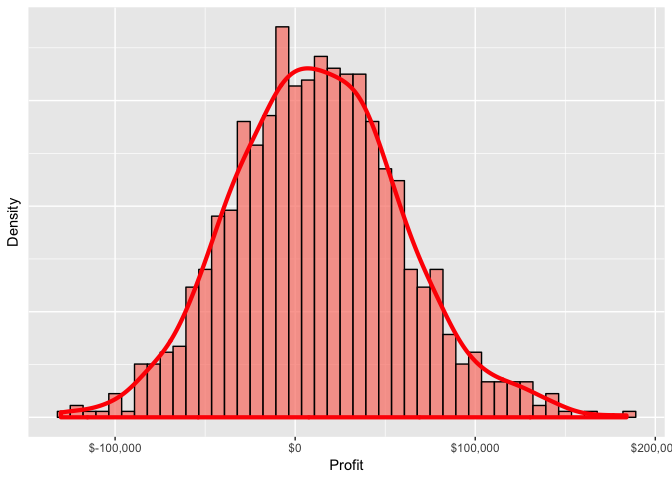
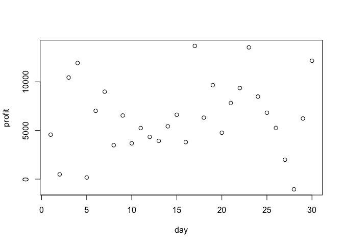
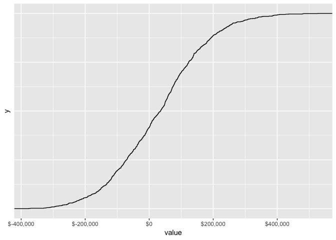

README
================
junfeng

第一题
------

``` r
set.seed(1212)
income=350:400 #销售价格 
leads_cost=8:10 #leads成本
constant_cost=20000 #固定成本
leads_cnt=3000:4000 #每天leads数量
leads_conversion <- matrix(rnorm(30, mean = 0.04, sd = 0.5/100), # 转化率
                   ncol = 2, byrow = FALSE) 
i=1:1000
profit_set <- function(income,leads_cnt,leads_conversion,constant_cost,leads_cost,m) {
  income_1 = sample(income, size = m, replace = TRUE)
  leads_cnt_1 = sample(leads_cnt, size = m, replace = TRUE)
  leads_conversion_1 = sample(leads_conversion, size = m, replace = TRUE)
  leads_cost_1 = sample(leads_cost, size = m, replace = TRUE)
  leads_cnt_1*leads_conversion_1*income_1-constant_cost-leads_cnt_1*leads_cost_1
}
temp <-  map_dbl(i, ~ {
  replicate(30,profit_set(income,leads_cnt,leads_conversion,constant_cost,leads_cost,1)) %>% 
  sum()
})
quantile(temp,c(0.005,0.995))
```

    ##      0.5%     99.5% 
    ## -102075.6  141480.9

``` r
temp1 <- temp %>% 
  as_data_frame()
temp1 %>% 
  ggplot(aes(x=value)) +
  geom_histogram(aes(y = ..density..), 
                 col = "black", fill = "salmon", alpha = .7, bins = 45) + 
  geom_density(col = "red", size = 1.5)+
  scale_x_continuous(labels = scales::dollar) +
  theme(axis.text.y = element_blank(), axis.ticks.y = element_blank()) +
  labs(x = "Profit", y = "Density")
```



第二题
------

``` r
# 利润高于10万
temp_10 <- ifelse(temp1>=100000,TRUE,FALSE)
table(temp_10) %>% prop.table()
```

    ## temp_10
    ## FALSE  TRUE 
    ## 0.962 0.038

``` r
# 利润小于0
temp_0 <- ifelse(temp1<0,TRUE,FALSE)
table(temp_0) %>% prop.table()
```

    ## temp_0
    ## FALSE  TRUE 
    ## 0.596 0.404

第三题
------

``` r
temp1 %>% 
ggplot(aes(x=value)) + 
  stat_ecdf() + #利润累计函数
  scale_x_continuous(labels = scales::dollar) +
  theme(axis.text.y = element_blank(), axis.ticks.y = element_blank()) 
```



第四题
------

``` r
# 4.1
temp41 <-  map_dbl(i, ~ {
  replicate(30,profit_set(income,leads_cnt,-0.181044846739997+0.0245604788599997*leads_cost,constant_cost,leads_cost,1)) %>% 
    sum()
})
temp41 <- temp41 %>% 
  as_data_frame()
temp41 %>% 
  ggplot(aes(x=value)) +
  geom_histogram(aes(y = ..density..), 
                 col = "black", fill = "salmon", alpha = .7, bins = 45) + 
  geom_density(col = "red", size = 1.5)+
  scale_x_continuous(labels = scales::dollar) +
  theme(axis.text.y = element_blank(), axis.ticks.y = element_blank()) +
  labs(x = "Profit", y = "Density")
```


``` r
# 4.2
# 利润高于10万
temp_410 <- ifelse(temp41>=100000,TRUE,FALSE)
table(temp_410) %>% prop.table()
```

    ## temp_410
    ## FALSE  TRUE 
    ## 0.697 0.303

``` r
# 利润小于0
temp_40 <- ifelse(temp41<0,TRUE,FALSE)
table(temp_40) %>% prop.table()
```

    ## temp_40
    ## FALSE  TRUE 
    ## 0.585 0.415

``` r
#4.3
temp41 %>% 
  ggplot(aes(x=value)) + 
  stat_ecdf() + #利润累计函数
  scale_x_continuous(labels = scales::dollar) +
  theme(axis.text.y = element_blank(), axis.ticks.y = element_blank()) 
```


