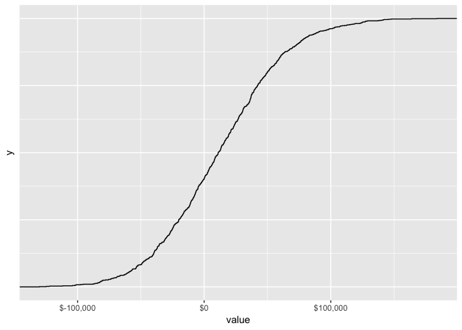

README
================
junfeng

第一题
------

``` r
income=350:400 #销售价格 
leads_cost=8:10 #leads成本
constant_cost=20000 #固定成本
leads_cnt=3000:4000 #每天leads数量
leads_conversion <- matrix(rnorm(30, mean = 0.04, sd = 0.5/100), # 转化率
                   ncol = 2, byrow = FALSE) 

profit_set <- function(income,leads_cnt,leads_conversion,constant_cost,leads_cost,m) {
  income_1 = sample(income, size = m, replace = TRUE)
  leads_cnt_1 = sample(leads_cnt, size = m, replace = TRUE)
  leads_conversion_1 = sample(leads_conversion, size = m, replace = TRUE)
  leads_cost_1 = sample(leads_cost, size = m, replace = TRUE)
  30*(leads_cnt_1*leads_conversion_1*income_1-constant_cost-leads_cnt_1*leads_cost_1)
}
temp <- replicate(1000,profit_set(income,leads_cnt,leads_conversion,constant_cost,leads_cost,1))
quantile(temp,c(0.005,0.995))
```

    ##      0.5%     99.5% 
    ## -543212.1  723397.0

第二题
------

``` r
# 利润高于10万
profit_10 <- function(income,leads_cnt,leads_conversion,constant_cost,leads_cost,m) {
  income_1 = sample(income, size = m, replace = TRUE)
  leads_cnt_1 = sample(leads_cnt, size = m, replace = TRUE)
  leads_conversion_1 = sample(leads_conversion, size = m, replace = TRUE)
  leads_cost_1 = sample(leads_cost, size = m, replace = TRUE)
  ifelse(30*(leads_cnt_1*leads_conversion_1*income_1-constant_cost-leads_cnt_1*leads_cost_1)>=100000,TRUE,FALSE)
}
temp_10 <- replicate(1000,profit_10(income,leads_cnt,leads_conversion,constant_cost,leads_cost,1))
table(temp_10) %>% prop.table()
```

    ## temp_10
    ## FALSE  TRUE 
    ## 0.673 0.327

``` r
# 利润小于0
profit_0 <- function(income,leads_cnt,leads_conversion,constant_cost,leads_cost,m) {
  income_1 = sample(income, size = m, replace = TRUE)
  leads_cnt_1 = sample(leads_cnt, size = m, replace = TRUE)
  leads_conversion_1 = sample(leads_conversion, size = m, replace = TRUE)
  leads_cost_1 = sample(leads_cost, size = m, replace = TRUE)
  ifelse(30*(leads_cnt_1*leads_conversion_1*income_1-constant_cost-leads_cnt_1*leads_cost_1)<0,TRUE,FALSE)
}
temp_0 <- replicate(1000,profit_0(income,leads_cnt,leads_conversion,constant_cost,leads_cost,1))
table(temp_0) %>% prop.table()
```

    ## temp_0
    ## FALSE  TRUE 
    ## 0.475 0.525

第三题
------

``` r
# 利润高于10万
i=1:30
profit_day <- function(income,leads_cnt,leads_conversion,constant_cost,leads_cost,i,m) {
  income_1 = sample(income, size = m, replace = TRUE)
  leads_cnt_1 = sample(leads_cnt, size = m, replace = TRUE)
  leads_conversion_1 = sample(leads_conversion, size = m, replace = TRUE)
  leads_cost_1 = sample(leads_cost, size = m, replace = TRUE)
  i*(leads_cnt_1*leads_conversion_1*income_1-constant_cost-leads_cnt_1*leads_cost_1)
}
temp_day <-  map_dbl(i, ~ {
  replicate(1000,profit_day(income,leads_cnt,leads_conversion,constant_cost,leads_cost,i,1)) %>% 
    mean()
})
plot(i, temp_day, xlab = "day", ylab = "profit")
```



第四题
------

``` r
#4.1
income_4=350:400 #销售价格 
leads_cost_4=8:10 #leads成本
constant_cost_4=20000 #固定成本
leads_cnt_4=3000:4000 #每天leads数量
#通过excel回归模型找到leads成本和转化的关系
#leads_conversion_4=-0.181044846739997+0.0245604788599997*leads_cost_4

profit_set_4 <- function(income,leads_cnt,leads_conversion,constant_cost,leads_cost,m) {
  income_1 = sample(income, size = m, replace = TRUE)
  leads_cnt_1 = sample(leads_cnt, size = m, replace = TRUE)
  leads_conversion_1 = sample(leads_conversion, size = m, replace = TRUE)
  leads_cost_1 = sample(leads_cost, size = m, replace = TRUE)
  30*(leads_cnt_1*leads_conversion_1*income_1-constant_cost-leads_cnt_1*leads_cost_1)
}
temp_4 <- replicate(1000,profit_set_4(income_4,leads_cnt_4,-0.181044846739997+0.0245604788599997*leads_cost_4,constant_cost_4,leads_cost_4,1))
quantile(temp_4,c(0.005,0.995))
```

    ##     0.5%    99.5% 
    ## -1117384  1365840

``` r
# 4.1
profit_10_4 <- function(income,leads_cnt,leads_conversion,constant_cost,leads_cost,m) {
  income_1 = sample(income, size = m, replace = TRUE)
  leads_cnt_1 = sample(leads_cnt, size = m, replace = TRUE)
  leads_conversion_1 = sample(leads_conversion, size = m, replace = TRUE)
  leads_cost_1 = sample(leads_cost, size = m, replace = TRUE)
  ifelse(30*(leads_cnt_1*leads_conversion_1*income_1-constant_cost-leads_cnt_1*leads_cost_1)>=100000,TRUE,FALSE)
}
temp_10_4 <- replicate(1000,profit_10_4(income_4,leads_cnt_4,-0.181044846739997+0.0245604788599997*leads_cost_4,constant_cost_4,leads_cost_4,1))
table(temp_10_4) %>% prop.table()
```

    ## temp_10_4
    ## FALSE  TRUE 
    ## 0.595 0.405

``` r
# 4.2
profit_0_4 <- function(income,leads_cnt,leads_conversion,constant_cost,leads_cost,m) {
  income_1 = sample(income, size = m, replace = TRUE)
  leads_cnt_1 = sample(leads_cnt, size = m, replace = TRUE)
  leads_conversion_1 = sample(leads_conversion, size = m, replace = TRUE)
  leads_cost_1 = sample(leads_cost, size = m, replace = TRUE)
  ifelse(30*(leads_cnt_1*leads_conversion_1*income_1-constant_cost-leads_cnt_1*leads_cost_1)<0,TRUE,FALSE)
}
temp_0_4 <- replicate(1000,profit_0_4(income_4,leads_cnt_4,-0.181044846739997+0.0245604788599997*leads_cost_4,constant_cost_4,leads_cost_4,1))
table(temp_0_4) %>% prop.table()
```

    ## temp_0_4
    ## FALSE  TRUE 
    ## 0.512 0.488
